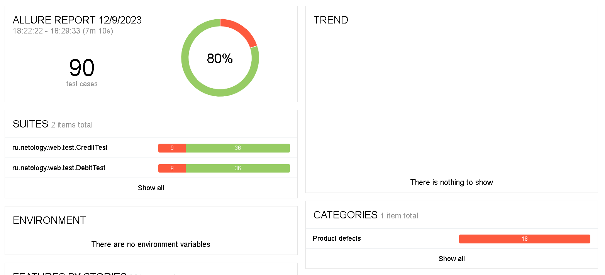

# Итоги тестирования

Было проведено тестировние позитивных и негативных сценариев покупки тура. 
Оплата на сервисе производится двумя способами: по дебетовой карте и по кредитной карте.
Приложение поддерживает две СУБД: MySQL и PostgreSQL.

Количество тест-кейсов - 90.
Процент успешных тест-кейсов - 80% (72 теста).
Процент неуспешных тест-кейсов - 20% (18 тестов).

Общие рекомендации:
1. Добавить селекторы `test-id` к элементам страниц.
2. Исправить баги, описанные в Issues.